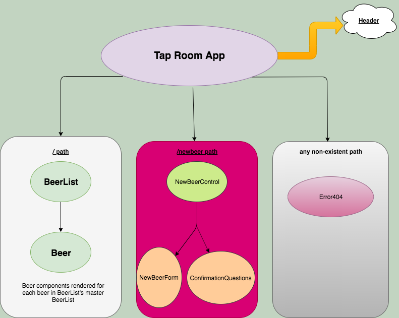

# &rew's Tap Room

### Description
This application is for a fictional beer taproom.  The user can see all the beers available, add new beers, and edit current beers.  The beer icon on each beer card will change color depending on the level of beer left in the keg.  There is a button for selling the beer, which will decrease the total volume of the beer by one pint.

### Component Structure


### Setup / Installation
* Download this repository
* Navigate to the directory in your terminal
* run the terminal command ```npm i```
* Run the terminal Command ``` npm run start```
* Navigate to http://localhost:8080/#/ in Google Chrome

### Technologies Used
* JavaScript
* React
* Bootstrap
* HTML / CSS
* hot loading
* LINT

### Support
For any questions or concerns feel free to send an email to drewcpete@gmail.com

### Known Bugs
Several features not functional:
* Adding a beer
* Color changing icon for keg fullness
* Editing exisisting beers

### License

&copy; 2019 MIT Open Source License
